# Unsupervised Learning applied to the Customer Lifetime Value (CLV) 

The core business of Insurance Companies is to enable individuals and firms to protect themselves against rarely events paying a small premium compared to the eventually damage incurred.

Customer Lifetime Value (CLV) evaluates the value of the customer for the Company, in other words, it’s the Net Present Value of the cash flows ascribed to the relationship with a customer. 

In this work, from the collection of portfolio contracts by one insurance year, will be predicted the Customer Lifetime Value of the last three months of the year, also looking at the effects coming from the use of Unsupervised Learning. 

Unsupervised Learning describes tasks that involves using a model to discover a good internal representation of input data useful for subsequent Supervised Learning. 

In this job Unsupervised Leaning are used to provide a low-dimensional representation of inputs and clustering numerical variables to provide a better portfolio analysis of customers. In both situations, Unsupervised Learning can be used as feature engineering to improve Machine Learning performances.

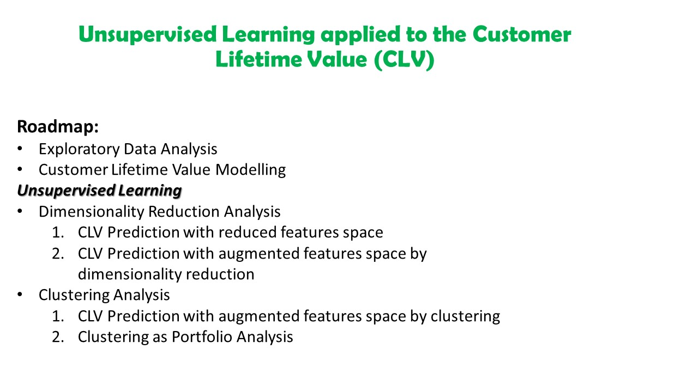

Go to the notebooks:

Analysis

-> [Exploratory Data Analysis](https://github.com/claudio1975/Customer_Lifetime_Value/blob/main/UL_CLV_EDA_OK2.ipynb)

-> [Dimensionality Reduction Analysis](https://github.com/claudio1975/Customer_Lifetime_Value/blob/main/UL_CLV_dim_reduction_analysis_OK3.ipynb)

-> [Clustering Analysis](https://github.com/claudio1975/Customer_Lifetime_Value/blob/main/UL_CLV_clustering_analysis_OK3.ipynb)

Recap Experiments

-> [CLV Modelling](https://github.com/claudio1975/Customer_Lifetime_Value/blob/main/UL_CLV_catch_up_models_rmse_OK3.ipynb)

-> [CLV prediction with reduced features space](https://github.com/claudio1975/Customer_Lifetime_Value/blob/main/UL_CLV_catch_up_dim_reduction_only_OK4.ipynb)

-> [CLV prediction with augmented features space by dimensionality reduction](https://github.com/claudio1975/Customer_Lifetime_Value/blob/main/UL_CLV_catch_up_fe_dim_reduction_OK4.ipynb)

-> [CLV prediction with augmented features space by clustering](https://github.com/claudio1975/Customer_Lifetime_Value/blob/main/UL_CLV_catch_up_clustering_OK3.ipynb)

-> [Clustering as Portfolio Analysis](https://github.com/claudio1975/Customer_Lifetime_Value/blob/main/UL_CLV_catch_up_clustering_viz_OK.ipynb)

Notebooks for each tool:

-> [Flat (baseline) model](https://github.com/claudio1975/Customer_Lifetime_Value/blob/main/UL_CLV_Flat_OK2.ipynb)

-> [Principal Component Analysis](https://github.com/claudio1975/Customer_Lifetime_Value/blob/main/UL_CLV_PCA_OK.ipynb)

-> [Autoencoder](https://github.com/claudio1975/Customer_Lifetime_Value/blob/main/UL_CLV_autoencoder_OK.ipynb)

-> [Isomap](https://github.com/claudio1975/Customer_Lifetime_Value/blob/main/UL_CLV_isomap_OK.ipynb)

-> [K-Means](https://github.com/claudio1975/Customer_Lifetime_Value/blob/main/UL_CLV_KMeans_OK.ipynb)

-> [DBSCAN](https://github.com/claudio1975/Customer_Lifetime_Value/blob/main/UL_CLV_DBSCAN_OK.ipynb)

-> [Gaussian Mixture Models](https://github.com/claudio1975/Customer_Lifetime_Value/blob/main/UL_CLV_GMM_OK.ipynb)

-> [Hierarchical Clustering](https://github.com/claudio1975/Customer_Lifetime_Value/blob/main/UL_CLV_hierachical_OK.ipynb)

### *Comparison between ML models to evaluate CLV prediction*

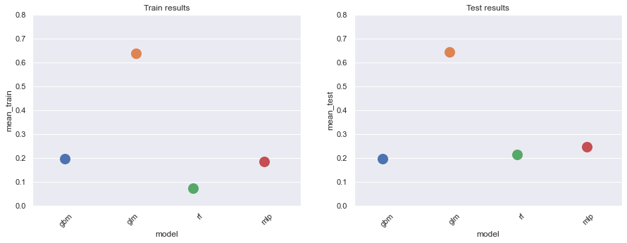

### *Comparison between Flat model (baseline) and other models built only with extracted features from dimensionality reduction*

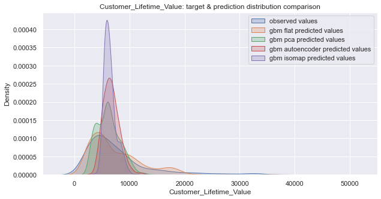

### *Comparison between Flat model (baseline) and other augmented models with feature engineering from dimensionality reduction*

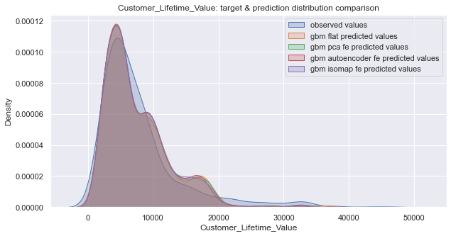

### *Comparison between several clustering methods applied to numerical features*

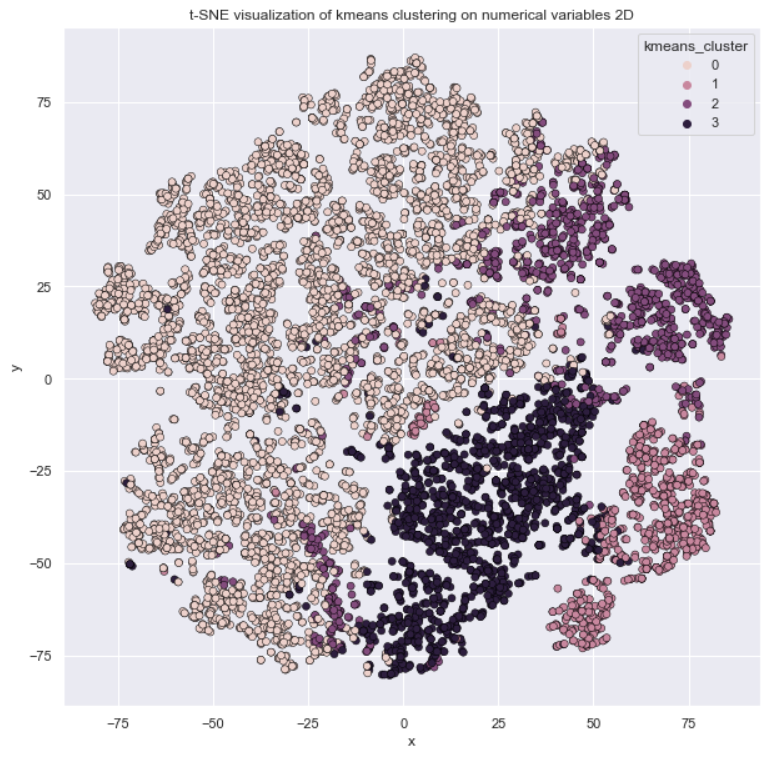

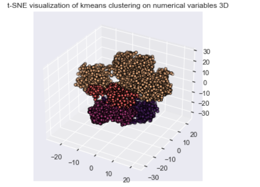

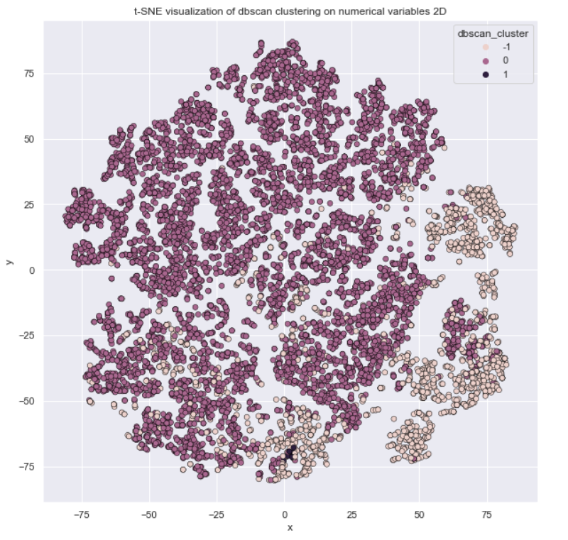

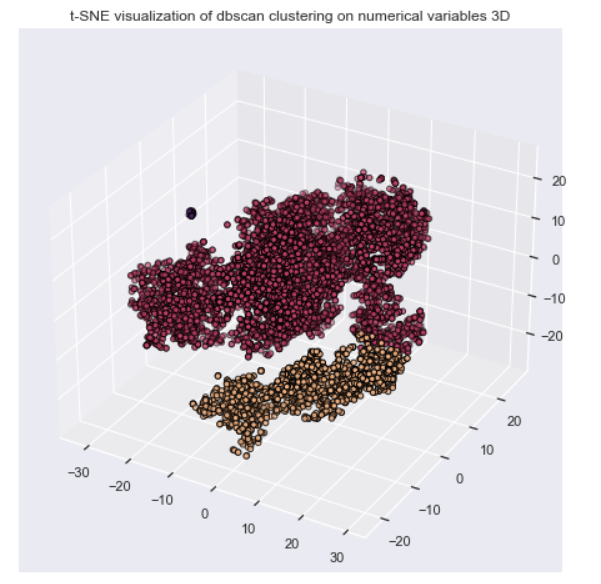

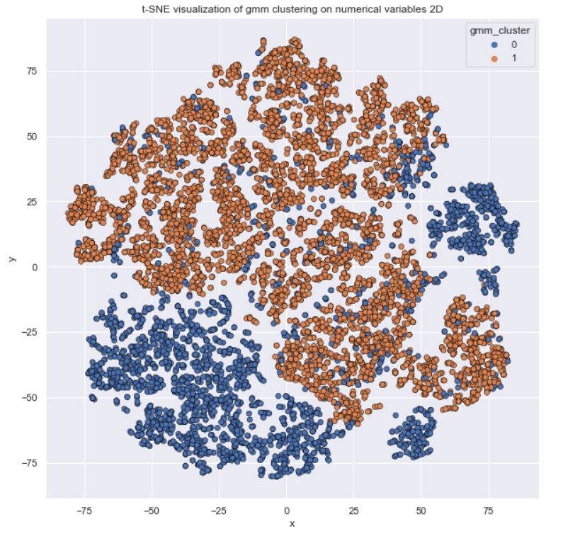

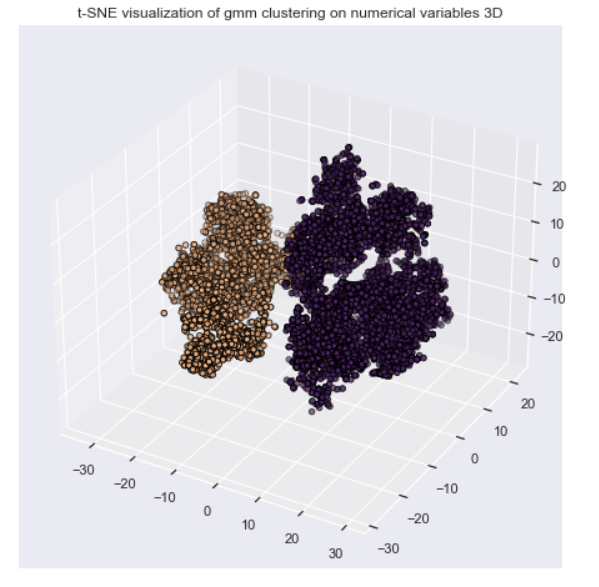

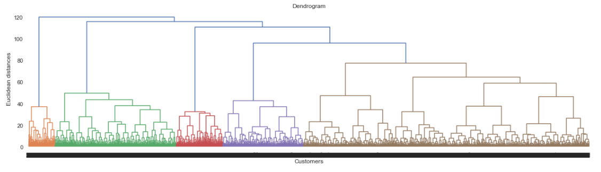

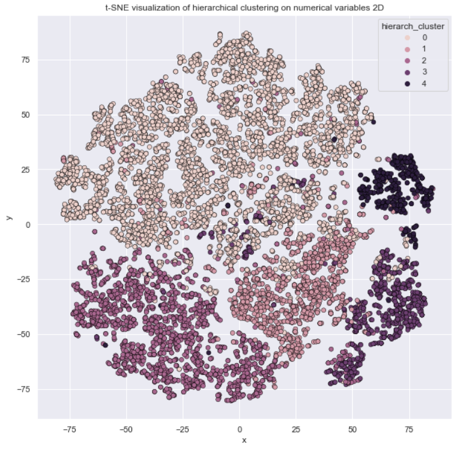

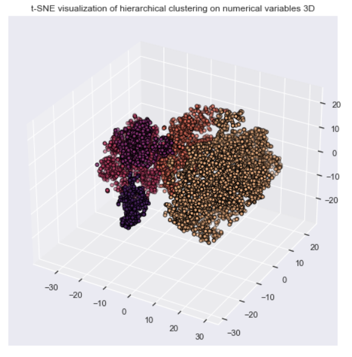

